# 🎧 Презентация проекта «WAVE STUDIO» (WaveProdMusic)
> **Концепция, слайды, дизайн-система и текст выступления для защиты премиального веб-проекта**

---

## 🌟 1. Общая концепция и позиционирование

* **Название проекта:** WAVE STUDIO (WaveProdMusic)
* **Слоган проекта:** *«Звук, который меняет игру. От идеи до платинового релиза в одном клике.»*
* **Суть проекта:** Это не просто стандартный сайт-визитка, а **интерактивная цифровая экосистема для звукозаписывающей студии нового поколения**. Платформа сочетает кинематографичный WebGL/3D-опыт, живую визуализацию звука через Web Audio API, встроенную браузерную цифровую рабочую станцию (Web-DAW) и автоматизированную систему бронирования сессий.
* **Целевая аудитория:** Артисты, саунд-продюсеры, битмейкеры, музыканты и лейблы, ищущие премиальное аналоговое качество звука и технологичный сервис.

---

## 🎨 2. Фирменный стиль и дизайн-система презентации

Для максимального «вау-эффекта» презентация должна строго повторять футуристичный стиль сайта:

| Элемент | Параметры | Описание |
| :--- | :--- | :--- |
| **Фон слайдов** | `#05010a` (Deep Space Obsidian) | Глубокий почти черный цвет с легким виньетированием |
| **Основной акцент** | `#9d4edd` & `#c77dff` (Electric Cyber-Purple) | Неоновый пурпурный для заголовков и акцентов |
| **Вторичный акцент** | `#ff4d4d` / `#ff6b6b` (Crimson Energy) | Для блока «Сырой звук / До» и маркеров внимания |
| **Текст** | `#f8f9fa` (чистый белый) и `#a09cb0` (приглушенный) | Идеальная читаемость на темном фоне |
| **Типографика** | **Unbounded / Montserrat** (Заголовки), **Inter / Segoe UI** (Основной текст) | Геометричные, современные шрифты |
| **Графические приемы** | Glassmorphism (матовое темное стекло), неоновое свечение (Glow), 3D-рендеринг, скриншоты реальных модулей |

---

## 📑 3. Детальная структура слайдов

```mermaid
flowchart LR
    S1["1. Интро & Вау-обложка"] --> S2["2. Проблема & Решение"]
    S2 --> S3["3. Архитектура экосистемы"]
    S3 --> S4["4. 3D-тур (Сфера WebGL)"]
    S4 --> S5["5. A/B Плеер & FFT-спектр"]
    S5 --> S6["6. Встроенная Web-DAW"]
    S6 --> S7["7. Слайдер оборудования 3D"]
    S7 --> S8["8. Отзывы & Плеер треков"]
    S8 --> S9["9. Smart Booking & Mini-CMS"]
    S9 --> S10["10. Технологический стек"]
    S10 --> S11["11. Результаты & Показатели"]
    S11 --> S12["12. Финал & Live Demo"]
```

---

### Слайд 1. Титульный слайд (Вау-эффект)
* **Заголовок:** WAVE STUDIO
* **Подзаголовок:** Инновационная цифровая экосистема и интерактивная платформа для звукозаписывающей студии
* **Визуал:** Полноэкранный скриншот первого экрана сайта: парящая 12-гранная 3D-сфера с фотографиями студии на фоне процедурных неоновых волокон (GhostFibers WebGL).
* **Нижняя плашка:** *Автор проекта: Руслан • 2026*
* **🎙️ Речь спикера (Что сказать):**  
  > *«Здравствуйте! Сегодня я представляю проект Wave Studio. В эпоху, когда 95% сайтов студий звукозаписи — это скучные статические прайс-листы из 2010-х, мы создали платформу нового поколения. Это интерактивный веб-опыт, который погружает музыканта в атмосферу студии еще до того, как он переступил наш порог.»*

---

### Слайд 2. Проблема рынка и Решение
* **Сравнение «Было» vs «Стало»:**
  * **❌ Проблема на рынке:**
    * Безликие шаблонные лендинги на конструкторах.
    * Невозможно удаленно оценить акустику и реальное качество сведения.
    * Нет интерактива: клиент пассивно скроллит и уходит.
    * Сложные формы заказа, где теряются заявки.
  * **✅ Решение Wave Studio:**
    * **Виртуальное погружение:** 12-гранная интерактивная 3D-панорама реальных зон студии.
    * **Аудио-доказательство:** интерактивный A/B-плеер для моментального сравнения «Сырой трек vs Финальный мастеринг».
    * **Интерактив внутри браузера:** полноценная рабочая станция Web-DAW для наброска битов онлайн.
    * **Бесшовная запись:** бронирование сессии с автоматическим оповещением.
* **🎙️ Речь спикера:**  
  > *«Музыка — это эмоциональный продукт. Артисту недостаточно прочитать строчку "Сведение за 3000 рублей". Ему нужно услышать разницу своими ушами, почувствовать вайб пространства и увидеть топовое железо. Наш сайт закрывает эти потребности за первые 30 секунд.»*

---

### Слайд 3. Главная фича №1: Интерактивный 3D-тур (Сфера WebGL)
* **Заголовок:** 3D VIRTUAL TOUR • 12-гранная сфера пространства
* **Визуальный ряд:** Крупный фокус на 3D-сфере. Стрелочками показать зоны: *Входная группа 24/7, Стена платиновых наград, Зона сведения SSL/Neve, VIP Studio Lounge, Акустическая кабина*.
* **Ключевые фичи:**
  * **12 граней в 3D:** математически выверенное зеркальное расположение фотосфер для идеального кругового обзора.
  * **Процедурный WebGL-фон GhostFibers:** кастомные шейдеры на базе математических волн и закручивающихся волокон без перегрузки видеокарты.
  * **Интерактивное управление:** перетаскивание мышью, плавный автоповорот, отклик на фокус.
* **🎙️ Речь спикера:**  
  > *«Сердце главного экрана — 12-гранная 3D-сфера виртуального тура. Посетитель может пальцем на смартфоне или курсором мыши вращать пространство студии, рассматривая винтажные аналоговые пульты, вокальные комнаты и VIP-лаунж. Это мгновенно формирует доверие премиального уровня.»*

---

### Слайд 4. Главная фича №2: Интерактивный A/B Аудиоплеер
* **Заголовок:** REAL-TIME A/B AUDIOPLAYER • Доказываем качество звуком
* **Визуальный ряд:** Скриншот плеера «ДО / ПОСЛЕ» с двумя режимами:
  * Красный режим: *ДО (Сырой звук, -6dB, каша в басу)*
  * Неоново-фиолетовый режим: *ПОСЛЕ (Мастеринг, пробивной панч, стереобаза 100%)*
* **Ключевые технологии:**
  * **Синхронизация с точностью до сэмпла:** два аудиопотока стартуют строго параллельно; переключение тумблера моментально меняет баланс частот без щелчков и задержек.
  * **Живой спектральный анализатор (Web Audio API):** 64 частотные полосы реагируют на реальные колебания звука. Басовые столбики слева подпрыгивают от бочки (808 / Kick), центр пульсирует от вокала, а верха искрятся от хэтов.
* **🎙️ Речь спикера:**  
  > *«Самый конверсионный элемент сайта — плеер сравнения "ДО и ПОСЛЕ". Клиент прямо во время воспроизведения нажимает кнопку и в реальном времени слышит, как тусклая демо-запись превращается в плотный коммерческий трек. А живой спектрометр на экране визуально подтверждает расширение стереобазы и плотность спектра.»*

---

### Слайд 5. Главная фича №3: Встроенная браузерная Web-DAW
* **Заголовок:** WEB-DAW STUDIO • Творчество прямо на сайте
* **Визуальный ряд:** Скриншот секции DAW: драм-пад (16 кнопок), сетка секвенсора, ползунки BPM и громкости, визуализатор трека.
* **Функционал станции:**
  * Интерактивный драм-пад с готовой библиотекой студийных сэмплов (Kick, Snare, Hi-Hats, 808, FX, Vox Chants).
  * Метроном, лупер и запись авторского бита в реальном времени.
  * Экспорт записанного трека в **MP3/WAV** прямо из браузера при помощи кодека `Lame.js`.
* **🎙️ Речь спикера:**  
  > *«Мы превратили сайт в инструмент для создания музыки. Любой артист может зайти в блок DAW, набить ритм на пэдах, записать бит и сразу скачать готовый MP3-файл. Это увеличивает время нахождения пользователя на сайте в 4–5 раз и делает его постоянным посетителем.»*

---

### Слайд 6. 3D Gear Showcase: Презентация студийного оборудования
* **Заголовок:** ANALOG & DIGITAL GEAR • Техническое превосходство
* **Визуальный ряд:** Карусель 3D Coverflow слайдера с карточками микрофонов Neumann, консоли Neve, преампов Universal Audio, мониторов Genelec.
* **Акценты:**
  * Эффект глубины (Depth 3D), полупрозрачные тени, разворот боковых карточек под углом 22°.
  * Четкие спецификации: ламповый тракт, динамический диапазон, аналоговый сатуратор.
* **🎙️ Речь спикера:**  
  > *«Для профессиональных музыкантов критически важно оборудование. Мы оформили паркинг приборов в виде объемной 3D-галереи Coverflow. Каждая карточка детально раскрывает характеристики железа, подчеркивая статус студии.»*

---

### Слайд 7. Социальное доказательство: Интерактивные отзывы артистов
* **Заголовок:** SOCIAL PROOF & RELEASES • Результаты наших резидентов
* **Визуальный ряд:** Карточки отзывов артистов с рейтингом звездами и **встроенным мини-аудиоплеером** (на примере релиза `M1klussshevskiy - ТТГ`).
* **Особенности:**
  * Можно не просто прочитать отзыв, но и сразу нажать кнопку «Play» и послушать трек, сведенный на нашей студии.
* **🎙️ Речь спикера:**  
  > *«Отзывы в виде скучного текста больше не работают. В Wave Studio каждый отзыв артиста подкреплен его реальным треком. Пользователь кликает на карточку и мгновенно слушает трек из чартов, записанный в наших стенах.»*

---

### Слайд 8. Smart Booking & Панель администратора
* **Заголовок:** АВТОМАТИЗАЦИЯ БИЗНЕСА • Бронирование и Mini-CMS
* **Визуальный ряд:** Скриншот формы бронирования сессии + интерфейс панели управления `admin.html`.
* **Архитектура:**
  * **Клиентская часть:** интерактивный выбор услуги (Запись вокала, Сведение, Битмейкинг) с динамическим расчетом стоимости, валидация полей (Regex email, телефон, выбор слота времени).
  * **Панель управления (Mini-CMS):** возможность администратора в реальном времени менять ценники на услуги, настраивать шаблоны оповещений и экспортировать базу бронирований.
  * **Уведомления:** моментальная отправка подтверждения на почту / в Telegram.
* **🎙️ Речь спикера:**  
  > *«Сайт полностью автоматизирует процесс лидогенерации. Клиент выбирает дату, время и нужный пакет, а администратор через встроенную панель управления может в 2 клика обновить прайс-лист на всем сайте сразу без правок в коде.»*

---

### Слайд 9. Технологический стек & Архитектура
* **Заголовок:** TECH STACK • Современные стандарты веб-разработки
* **Таблица технологий:**

| Уровень | Технологии | Назначение |
| :--- | :--- | :--- |
| **Frontend** | Vanilla JS (ES6+), HTML5, CSS3 Custom Properties | Максимальная скорость загрузки, 0 тяжелых фреймворков |
| **3D & Shaders** | WebGL 2.0, OGL Core, GLSL Shaders | 60 FPS рендеринг волокон и 3D-сферы |
| **Audio Engine** | Web Audio API, AnalyserNode, Lame.js | Живая визуализация волны, экспорт аудио в MP3 |
| **Инфраструктура** | Cloudflare Pages, Edge CDN, GitHub CI/CD | Неубиваемый хостинг со скоростью отдачи < 50ms по всему миру |

* **🎙️ Речь спикера:**  
  > *«С технической точки зрения проект написан на чистом Vanilla JS и WebGL без использования медленных тяжелых фреймворков. Это обеспечивает молниеносный запуск, 60 кадров в секунду на смартфонах и нулевую уязвимость. Хостинг развернут на Cloudflare Pages с глобальным кэшированием.»*

---

### Слайд 10. Адаптивность и производительность (Mobile First)
* **Заголовок:** MOBILE RESPONSIVE • 100% удобство на любых экранах
* **Визуальный ряд:** Композиция: экран ноутбука, планшета и смартфона с идеальной версткой сайта.
* **Тезисы:**
  * Touch-жесты для 3D-сферы и слайдеров.
  * Плавный скролл, аппаратное ускорение анимаций (`will-change`, `transform: translate3d`).
  * Полная кроссбраузерная совместимость (Chrome, Safari iOS, Firefox, Edge).

---

### Слайд 11. Планы развития (Roadmap проекта)
* **Слайд с таймлайном будущего развития:**
  * 🔹 **Q1:** Внедрение Telegram WebApp (бронирование сессий прямо из мессенджера).
  * 🔹 **Q2:** Онлайн-калькулятор стоимости многодорожечного сведения со стем-загрузчиком.
  * 🔹 **Q3:** Внедрение ИИ-помощника для быстрой пред-оценки качества исходного вокала артиста.
* **🎙️ Речь спикера:**  
  > *«Мы создали не просто сайт, а масштабируемую платформу. В ближайших планах — подключение Telegram WebApp для моментальной записи постоянных клиентов и стем-загрузчик исходников прямо в студию.»*

---

### Слайд 12. Финальный слайд (Call To Action & Demo)
* **Заголовок:** WAVE STUDIO • Звучите так, как заслуживаете.
* **Центральный элемент:** Крупный красивый **QR-код** со ссылкой на живой работающий сайт на Cloudflare Pages.
* **Контакты:** Telegram, Почта, Ссылка на GitHub репозиторий.
* **Кнопка-призыв:** *«Попробуйте живое демо прямо со своего смартфона!»*
* **🎙️ Речь спикера:**  
  > *«Спасибо за внимание! Приглашаю вас отсканировать QR-код на экране или перейти по ссылке — и протестировать 3D-сферу, A/B-плеер и нашу Web-DAW прямо сейчас. Буду рад ответить на любые ваши вопросы!»*

---

## 🛠️ 4. Практические советы по сборке презентации

1. **Где делать:** 
   * **Figma** (самый стильный вариант для темных неоновых интерфейсов).
   * **PowerPoint / Keynote** (экспортируйте скриншоты сайта в формате PNG с прозрачностью).
   * **Pitch.com** (отличный современный инструмент для IT-презентаций).
2. **Как показывать:**
   * Не перегружайте слайды простынями текста — весь основной текст выше вынесен в речь спикера. На слайде должны быть **сочные скриншоты, короткие буллиты с технологиями и ключевые цифры**.
   * Если позволяет формат (например, ноутбук с проектором), **в конце презентации переключитесь на живую вкладку сайта** и покажите вращение 3D сферы и переключение плеера A/B вживую — это производит колоссальное впечатление!
